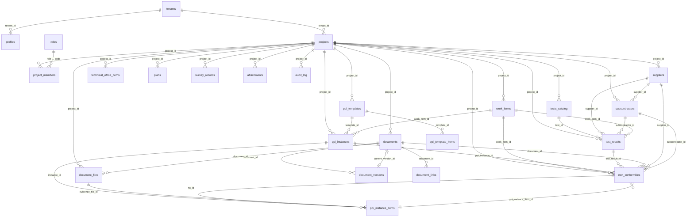

# ATLAS — Grafo de Relações

> Gerado a partir do schema Supabase em 2026-02-23.

---

## 1. Diagrama Mermaid



---

## 2. Lista Explícita de Relações

### 2.1 Relações 1–N (FK directas)

| Pai | Filho | FK no filho | Tipo |
|-----|-------|-------------|------|
| `tenants` | `profiles` | `tenant_id` | 1–N |
| `tenants` | `projects` | `tenant_id` | 1–N |
| `projects` | `project_members` | `project_id` | 1–N |
| `projects` | `work_items` | `project_id` | 1–N |
| `projects` | `documents` | `project_id` | 1–N |
| `projects` | `document_files` | `project_id` | 1–N |
| `projects` | `tests_catalog` | `project_id` | 1–N |
| `projects` | `test_results` | `project_id` | 1–N |
| `projects` | `ppi_templates` | `project_id` | 1–N |
| `projects` | `ppi_instances` | `project_id` | 1–N |
| `projects` | `non_conformities` | `project_id` | 1–N |
| `projects` | `suppliers` | `project_id` | 1–N |
| `projects` | `subcontractors` | `project_id` | 1–N |
| `projects` | `technical_office_items` | `project_id` | 1–N |
| `projects` | `plans` | `project_id` | 1–N |
| `projects` | `survey_records` | `project_id` | 1–N |
| `projects` | `attachments` | `project_id` | 1–N |
| `projects` | `audit_log` | `project_id` | 1–N |
| `roles` | `project_members` | `role` → `code` | 1–N |
| `documents` | `document_versions` | `document_id` | 1–N |
| `documents` | `document_files` | `document_id` | 1–N |
| `documents` | `document_links` | `document_id` | 1–N |
| `tests_catalog` | `test_results` | `test_id` | 1–N |
| `ppi_templates` | `ppi_template_items` | `template_id` | 1–N |
| `ppi_templates` | `ppi_instances` | `template_id` | 1–N (opt.) |
| `ppi_instances` | `ppi_instance_items` | `instance_id` | 1–N |
| `work_items` | `ppi_instances` | `work_item_id` | 1–N |
| `work_items` | `test_results` | `work_item_id` | 1–N (opt.) |
| `work_items` | `non_conformities` | `work_item_id` | 1–N (opt.) |
| `suppliers` | `test_results` | `supplier_id` | 1–N (opt.) |
| `suppliers` | `non_conformities` | `supplier_id` | 1–N (opt.) |
| `suppliers` | `subcontractors` | `supplier_id` | 1–N (opt.) |
| `subcontractors` | `test_results` | `subcontractor_id` | 1–N (opt.) |
| `subcontractors` | `non_conformities` | `subcontractor_id` | 1–N (opt.) |
| `ppi_instances` | `non_conformities` | `ppi_instance_id` | 1–N (opt.) |
| `ppi_instance_items` | `non_conformities` | `ppi_instance_item_id` | 1–N (opt.) |
| `test_results` | `non_conformities` | `test_result_id` | 1–N (opt.) |
| `documents` | `non_conformities` | `document_id` | 1–N (opt.) |

### 2.2 Relações N–N (via tabela intermediária)

| Entidade A | Entidade B | Tabela ponte | Chaves |
|------------|------------|--------------|--------|
| `documents` | Qualquer entidade | `document_links` | `document_id` + `linked_entity_type` + `linked_entity_id` |
| Qualquer entidade | Ficheiros | `attachments` | `entity_type` + `entity_id` (polimórfico) |

### 2.3 Relações Self-referencing

| Tabela | Campo | Aponta para |
|--------|-------|-------------|
| `documents` | `current_version_id` | `document_versions.id` |

---

## 3. Relações por Módulo (Vista Funcional)

### Work Items (centro do grafo)

```
work_items ←── ppi_instances        (1–N, obrigatório)
work_items ←── test_results         (1–N, opcional)
work_items ←── non_conformities     (1–N, opcional)
work_items ←── document_links       (N–N via document_links)
```

### PPI (cascata de inspeção)

```
ppi_templates → ppi_template_items  (1–N)
ppi_instances → ppi_instance_items  (1–N)
ppi_instance_items → non_conformities (via nc_id e fn_create_nc_from_ppi_item)
ppi_instance_items → document_files   (via evidence_file_id)
```

### NC (ponto de convergência)

```
non_conformities ← work_items       (work_item_id)
non_conformities ← ppi_instances    (ppi_instance_id)
non_conformities ← ppi_instance_items (ppi_instance_item_id)
non_conformities ← test_results     (test_result_id)
non_conformities ← documents        (document_id)
non_conformities ← suppliers        (supplier_id)
non_conformities ← subcontractors   (subcontractor_id)
```

### Fornecedores / Subempreiteiros

```
suppliers ← test_results       (supplier_id)
suppliers ← non_conformities   (supplier_id)
suppliers ← subcontractors     (supplier_id, opcional)
suppliers ← document_links     (N–N)
subcontractors ← test_results  (subcontractor_id)
subcontractors ← non_conformities (subcontractor_id)
```

---

## 4. Análise de Conformidade

### ✅ Tabelas com `project_id` (conformes)

Todas as 18 tabelas de negócio possuem `project_id` com FK para `projects.id`.

### ✅ Tabelas com campos standard

Todas possuem `id uuid PK`, `created_at timestamptz`.
Todas as que necessitam possuem `updated_at` com trigger.

### ⚠️ Observações

1. **`attachments`**: Usa padrão polimórfico (`entity_type` + `entity_id`) — não tem FK directa para entidades. Aceitável para flexibilidade.
2. **`document_links`**: Mesmo padrão polimórfico — `linked_entity_type` + `linked_entity_id`. Aceitável.
3. **`audit_log`**: Usa `entity` (text) em vez de FK — por design (logs referem qualquer tabela).
4. **`non_conformities.responsible`**: É `text` em vez de `uuid FK`. Campo usado como texto livre (nome). Considerar migrar para `uuid FK → profiles.user_id` no futuro.
